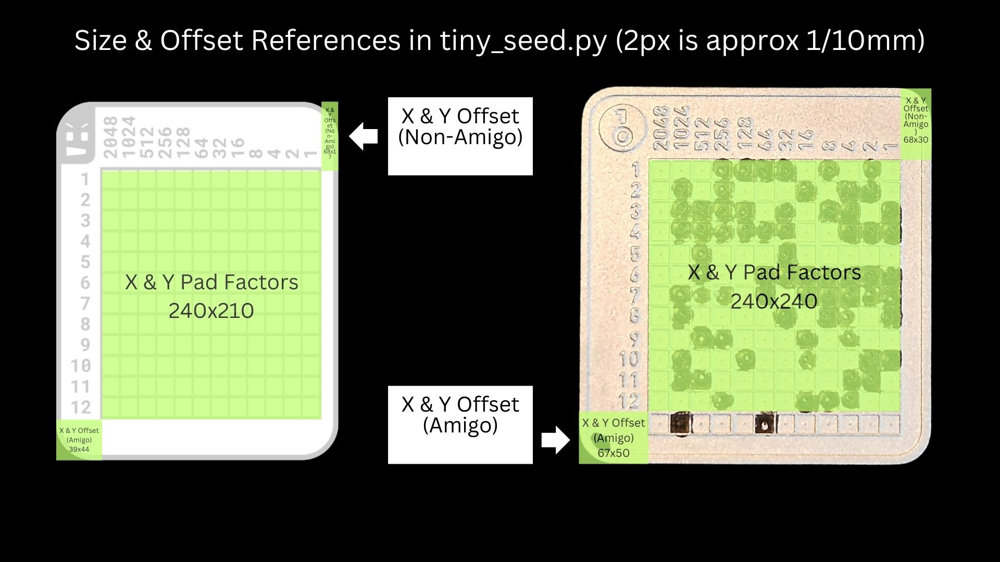

## Background
The examples below have been crated so that you can test the workflow for scanning both 12 and 24 word mnemonics. (Scanning the left plate for a 12 word mnemonic and both plates for 24) The resulting fingerprint from an successful scan is also incldued in the image.

### TinySeed

### OneKey KeyTag

### Binary Grid

## Size, Offset and Padding Reference
The general logic for how these are processed is:

1. Krux first looks for a square (Which works best if with a well lit square, with clean edges, on a dark background)
2. This square is checked and if the ratio of length to height is within a defined range for the given seed type, the square is further processed. (Uses the aspect_high and aspect_low variables)
3. An X and Y offset are applied to work out the corner of the seed grid within the seed plate. Some devices like the Maix Amigo use a mirrored coordinate system and some seed types will have a slightly different layout on the front and back of the plate. (Uses the x_offset and y_offset variables, p0 for the front face and p1 for the reverse face)
4. The location of each cell within the 12x12 grid is calculated. (This uses the xpad and ypad variables)
5. Krux uses the grid created in 4 to evaluate which cells are marked and which are blank, once a seed with a valid checksum is detected, the user can then confirm the dots.

If you have a different type of grid that you want to use, you will need to edit the offsets and padding numbers in tiny_seed.py. (All of the sizes are scaled based on the size of the square detected in step 1...)

You can match the pre-sets for supported key-types to the physical dimensions of the tag as shown below. (The numbers for these offsets are in 1/10th of a millimeter)

