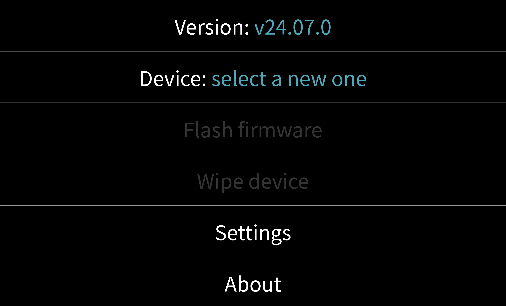

This page explains how to install Krux with KruxInstaller (GUI).

### Installing from a GUI

You can install krux onto your K210-based device using our official desktop application, which we named [KruxInstaller](https://github.com/selfcustody/krux-installer), available for Linux and Windows.

Under the hood the GUI uses the same methods described in [Installing from pre-build release](../installing/from-pre-built-release.md), i.e. download, verify and flash the latest official release, but you won't need to type any command. Additionally you will be able to install the [pre-built test (beta) release](../installing/from-test-release.md) too.

Keep in mind that this is software under development in the alpha stage and may be buggy. If you find any bugs or want to contribute to the project, please open an [issue](https://github.com/selfcustody/krux-installer/issues) or make a PR.

### Requirements
#### Hardware
Please, check the [part list](../../parts.md) for the compatible devices and requirements.

#### Download the latest release

The primary way to download the installer is via [releases page on Github](https://github.com/selfcustody/krux-installer/releases), search for `Assets` and click the dropdown arrow:


##### Archlinux users
There is a package named [`krux-installer-bin`](https://aur.archlinux.org/packages/krux-installer-bin) for Archlinux in the [AUR](https://aur.archlinux.org/). To install `krux-installer-bin`, You need to have the [yay](https://github.com/Jguer/yay) package manager installed. Then run on your terminal:

```bash
yay -Sy krux-installer-bin
```

#### Verify the files
Before installing the release, it's a good idea to check if the hash sum matches the one defined in the file `*.sha256.txt`:

##### On Linux
```bash
sha256sum --check KruxInstaller-0.0.1-alpha-4.AppImage.sha256.txt KruxInstaller-0.0.1-alpha-4.AppImage
```

##### On Windows with `powershell`
```pwsh
(Get-FileHash '.\KruxInstaller.Setup.0.0.1-alpha-4.exe').Hash -eq (Get-Content '.\KruxInstaller.Setup.0.0.1-alpha-4.exe.sha256.txt')
```

#### Modify permissions
If you use Linux, you will need to add permission to allow execution of the `.AppImage` file:

```bash
chown +x ./KruxInstaller-0.0.1-alpha-4.AppImage
```

If you use Windows, the first time you run the `.exe` file the system will ask you if you trust the application. Click on `more info` and then `Run anyway`.

### Openssl
When downloading the official krux firmware, it is necessary to verify the signature to confirm the authenticity of the binaries using OpenSSL tool.

On Linux, verification is easily done since OpenSSL is already installed. On windows we would need to install it first. To avoid that, we packaged a stable version of OpenSSL, compiled from source. The compilation process is done entirely in a virtual environment on github and it is expected to be fully verifiable and free of malicious code. You can check the build steps in [github actions](https://github.com/selfcustody/krux-installer/actions).

### Usage
When running Krux Installer, you will be presented with a menu of three items:

- Select device;
- Select version;
- Flash;



#### Select device
This is the first step, to select the device we want to flash. Click on the dropdown arrow to list the supported devices, each one have a different firmware. Then click on SELECT.


#### Select version
Now select which firmware you want to flash, i.e. the [latest official release](https://github.com/selfcustody/krux/releases) or the [test (beta) release](https://github.com/odudex/krux_binaries). While in the official release we can [verify its integrity and authenticity](from-pre-built-release.md/#verify-the-files), in the second one we will have no means of verifying it, because it is not signed. However, the test (beta) firmware will contain the newest features that are being developed and discussed on our social media.

##### Official release
The software will display the latest officially released version in the form `selfcustody/tags/vXX.YY.Z`, where XX means the year of release, YY the month of release and Z a subversion of this release.

Once selected, the application will check if the entry exists in the system. If not, it will download the following files: the firmware as a `.zip`, the sha256 of the zip as `sha256.txt`, the signature of the zip as `.sig` and the `selfcustody.pem`.

- `krux-vXX.YY.Z.zip`: contains all the necessary binaries and signature files to install the firmware on each of the supported devices;

- `krux-vXX.YY.Z.zip.sha256.txt`: contains a hash to verify the integrity of the downloaded `zip` file;

- `krux.vXX.YY.Z.zip.sig`: is the public digital signature for authenticity verification of the downloaded `zip` file;

- `selfcustody.pem`: is the public digital certificate that attests to the veracity of the public digital signature.


If they are already present on your computer, the application will give you the option to download them again or continue with the files already downloaded.


##### Test (beta) binaries
As the name suggests, these binaries are intended for test purposes, contain experimental features, and are more likely to contain bugs. Use only for experimentation and to provide feedback.

The installer will present the latest test (beta) release.


- `<device>/firmware.bin`: is the unsigned firmware's binary of the choosen device;
- `<device>/kboot.kfpkg`: is the unsigned and compressed firmware bootloader of the choosen device;
- `<device>/ktool-<os>`: is the k210 tool "flasher" specific to Operational system:
    - `ktool-linux`: for linux machines;
    - `ktool-win.exe`: for windows machines;

If they are already present on your computer, the application will give you the option to download them again or continue with the files already downloaded.


#### Flash
Once we choose the device and firmware, we can flash. Before start the flash process itself, you be warned that you must plug and power on your device.


----8<----
amigo-more-info-faq.md
----8<----

### Multilingual support
Prefer a different language? Krux has support for multiple languages. Once at the start screen, go to `Settings`, followed by `Locale`, and select the locale you wish to use.

### Upgrade via microSD card
Once you've installed the initial firmware on your device via USB, you can either continue updating the device by flashing or you can perform upgrades [via microSD](../features/sd-card-update.md) card to keep the device airgapped.
